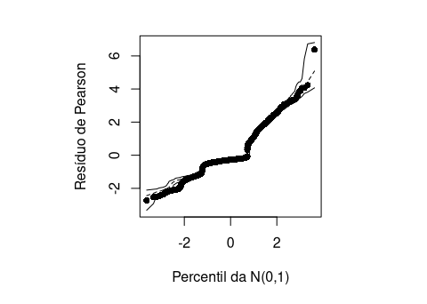

\captionsetup[table]{labelformat=empty}
\counterwithin*{equation}{section}

```{r setup, echo=F}
knitr::opts_chunk$set(fig.align = "center", echo = FALSE, fig.width = 5, fig.height = 3.57)
suppressPackageStartupMessages({
  library(Hmisc)
  library(knitr) 
  library(kableExtra)
  library(gamlss)
  library(pscl)
  library(ggthemes)
  library(tidyverse) 
  library(robustbase)
  library(cowplot)
  library(janitor)
  library(texreg)
  library(patchwork)
  library(GGally)
  library(aplore3)
  library(broom)
  library(gt)
  library(gtsummary)
  library(gee)
  library(geepack)
})
theme_set(cowplot::theme_minimal_grid(font_size = 11))
```

# Exercício 1


A base disponibilizada corresponde à uma análise para entender a associação entre o uso de 3 medicamentos diferentes ou mais no tratamento de doenças mentais. Essa variável é `polypharmacy` (=0 uso de no máximo 3 medicamentos diferentes; =1 uso de mais de 3 medicamentos diferentes). O estudo consiste em acompanhar 500 indivíduos ao longo de 7 anos observando o uso de medicamentos e as variáveis explicativas, que consistem em:

- (i) `mhv4`: número de consultas ambulatoriais relacionadas à saúde mental (nenhum, 'um a cinco', 'seis a quatorze' e  'maior do que quatorze')
- (ii) `inptmhv3`:  número de internações hospitalares relacionadas à saúde mental ('nenhuma', 'uma' e 'mais do que uma')
- (iii) `gender`: gênero ('Feminino', 'Masculino'), 
- (iv) `urban`: local de residência ('Urbana', 'Rural')) 
- (v) `comorbid`: existência de comorbidade ('Não', 'Sim') 
- (vi) `age`: idade em anos

Abaixo mostro as primeiras 10 linhas da base, que mostram as 7 observações do indivíduo com `id` = 1 e os dois primeiros anos para o segundo indivíduo.


```{r}
df <- polypharm %>% 
  select(polypharmacy,id, year, mhv4, inptmhv3, gender, urban, comorbid, age)
  #mutate(polypharmacy = if_else(polypharmacy == 'Yes', 1, 0))

df %>% head(10) %>% 
  kable(booktabs = T, align = "c")  %>% 
  kable_styling(position = "center") 
```


## Análise descritiva


Iniciaremos a análise descritiva analisando as tabelas de contingência da variável resposta, `polipharmacy` contra cada uma das variáveis categóricas. Um ponto importante antes de começarmos.  Na inspeção da variável `urban`, que representa o local de residência dos indivíduos, foi notado que o indivíduo com id=490 não teve sua localização de residência marcada na base de dados no último ano do estudo. Notamos que em todos os anos do estudo anteriores seu local de moradia era urbano. Por isso decidimos inserir o dado faltante com essa mesma informação.


```{r message=FALSE, warning=FALSE}

df %>% 
  select(-year, -id, -age) %>% 
  mutate(comorbid = if_else(comorbid == 'Yes', 'Com comorbidade', 'Sem comorbidade')) %>% 
  tbl_summary(
    by = polypharmacy, 
    missing_text = "(Não disponível)", 
    percent = 'cell'
  )  %>%
  add_overall(last = T, col_label = '**Total**, N=3500') %>% 
  modify_header(label ~ "**Variável**") %>%
  modify_footnote(
   starts_with("stat_") ~ "Estatísticas apresentadas: número de casos (% sob o total). A soma das porcentagens sob uma mesma variável explicativa, excluindo a coluna total é 1"
  ) %>%
  bold_labels() %>% 
  modify_spanning_header(c("stat_1", "stat_2") ~ "**Usa 3 medicamentos ou mais**") %>%  
  as_gt() %>% 
  tab_row_group(
    group = "     ",
    rows = 1:5
  ) %>%
    tab_row_group(
    group = "    ",
    rows = 6:9
  ) %>%
    tab_row_group(
    group = "   ",
    rows = 10:12
  ) %>%
    tab_row_group(
    group = "  ",
    rows = 13:16
  ) %>%
    tab_row_group(
    group = " ",
    rows = 17:19
  ) %>%
  gt::as_latex()

```


A variável que representa a coexistência de doenças, `comorbid` está concentrada na não presença de comorbidades. Podemos ver que nesse caso, 25% = 739/2879 (ou 21% do total, 739/3500) dos indivíduos-ano fazem o uso de 3 ou mais medicamentos. A chance de polifarmácia parece indicar que aqueles sem comorbidades, 739/2140 = `r round(739/2140, 2)`, tem mais chances de usar 3 ou mais medicamentos que os indivíduos com comorbidades, 80/541 = `r round(80/541, 2)`.

Com relação ao local de residência (`urban`) existe uma prevalência de residências urbanas. As chances entre regiões urbanas e rurias de um indivíduo ser polifarmaco são parecdidas,  585/1944 = `r round(585/1944, 2)` (urbano),  233/737 = `r round(233/737, 2)` (rural).

Quando estratificamos por gênero, podemos detectar que dentre os indivíduos do sexo masculino há proporção de individuos que usam muitos medicamentos maior que nos indivíduos do sexo feminino. A amostra pode ser descrita como desbalanceada com relação ao gênero uma vez que `r scales::percent(386/(386 + 114))` dela é do sexo masculino.

Ao analisarmos a variável `inptmhv3`, que representa o número de internações por doenças mentais, podemos notar a crecente proporção de polifarmácia, partindo de uma chance de 723/2610 = `r round(723/2610, 2)`quando não existem internações para 70/51 = `r round(70/51, 2)` quando temos o histórico de uma internação e 26/20 = `r round(26/20, 2)` quando tem mais de uma internação.

Por fim, a inspeção do número de consultas ambulatoriais relacionadas à saúde mental (variável `mhv4`) nos indica que ~40% da amostra está concentrada em indivíduos que realizaram 6 ou mais consultas. A chance de polifarmácia aumenta com o número de consultas aparentemente, uma vez que a chance quando não houveram consultas é 44/514 = `r round(44/514, 2)` e quando os pacientes tiveram 14 consultas ou mais 419/612 = `r round(419/612, 2)`.

A inspeção do boxpot a seguir nos mostra que os indivídos que usam 3 medicamentos ou mais no tratamentos de doenças mentais têm, em mediana, idades mais elevadas e um indivíduo que pode ser considerado atípico por sair dos limites do gráfico. No caso de indivíduos que usam menos de 3 medicamentos, além de serem mais jovens, temos uma concetração de idades baixas possívelment atípicas quando comparadas com o resto da distribuição.

```{r}
robustbase::adjbox(age ~ polypharmacy, 
                   data = df, varwidth=F, 
                   horizontal=T, xlab='Idade', ylab='Polifármaco',
                   main='Boxplot robusto')
```

## Ajuste de modelos

### Equação de estimação generalizada Bernoulli

#### Seleção de modelo

O primeiro modelo que iremos estimar é uma equação de estimação generalizada com uma estrutura probabilística de Bernoulli e uma estrutura de correlação auto-regressivo de ordem 1. O pacote sugerido para a análise, o **gee** não possui comparação de modelos via testes de comparação de modelos encaixados. Por isso, para realizar a seleção de modelos vamos depender de comparações univariadas via testes de Wald, uma vez que o quadrado do Z-robusto segue uma distribuição chi quadrado com um grau de liberdade.

Nessas comparações univariadas, quando a variável possui apenas dois fatores e fosse não significativa retiramos a variável. No caso da variável categórica ordinal, quando um dos fatores não era significativo ele foi juntado com um dos fatores abaixo ou acima dele de acordo com o contexto. A seguir está o código desse procedimento da seleção do modelo. 


```r
df <- df %>% 
  mutate(urban = if_else(id == 409 & year == 2008, 
                         factor('Urban', levels=c('Urban', 'Rural')), 
                         urban)) 

df['resp'] =  if_else(df$polypharmacy == 'Yes', 1, 0)
 
fit1.poly = gee(resp ~ mhv4 + inptmhv3 + gender + urban + comorbid + log(age/100), 
                id = id, family = binomial(link = "logit"),
                corstr = "AR-M", Mv = 1, data=df)

fit2.poly = gee(resp ~ mhv4 + inptmhv3 + gender + urban + log(age/100), 
                id = id, family = binomial(link = "logit"),
                corstr = "AR-M", Mv = 1, data=df)

fit3.poly = gee(resp ~ mhv4 + inptmhv3 + gender + log(age/100), 
                id = id, family = binomial(link = "logit"),
                corstr = "AR-M", Mv = 1, data=df)

df1 <- df %>% 
  mutate(inptmhv3 = case_when(
    inptmhv3 == '1' ~ '>=1', 
    inptmhv3 == '> 1' ~ '>=1',
    T ~ '0'
  ) %>% factor(., levels = c('0', '>=1')))

fit4.poly = gee(resp ~ mhv4 + inptmhv3 + gender + log(age/100),
                id = id, family = binomial(link = "logit"),
                corstr = "AR-M", Mv = 1, data=df1)

df2 <- df1 %>% 
  mutate(mhv4 = case_when(
    mhv4 == '0' ~ '0-5', 
    mhv4 == '1-5' ~ '0-5',
    T ~ as.character(mhv4)
  ) %>% factor(., c('0-5', '6-14', '> 14')))

fit5.poly = gee(resp ~ mhv4 + inptmhv3 + gender + log(age/100), 
                id = id, family = binomial(link = "logit"),
                corstr = "AR-M", Mv = 1, data=df2)
```

```{r message=FALSE, warning=FALSE, results='hide'}
df <- df %>% 
  mutate(urban = if_else(id ==409 & year == 2008, 
                         factor('Urban', levels=c('Urban', 'Rural')), 
                         urban)) 

df['resp'] =  if_else(df$polypharmacy == 'Yes', 1, 0)
 

fit1.poly = gee(resp ~ mhv4 + inptmhv3 + gender + urban + comorbid + log(age/100), 
                id = id, family = binomial(link = "logit"),
                corstr = "AR-M", Mv = 1, data=df)

fit2.poly = gee(resp ~ mhv4 + inptmhv3 + gender + urban + log(age/100), 
                id = id, family = binomial(link = "logit"),
                corstr = "AR-M", Mv = 1, data=df)

fit3.poly = gee(resp ~ mhv4 + inptmhv3 + gender + log(age/100), 
                id = id, family = binomial(link = "logit"),
                corstr = "AR-M", Mv = 1, data=df)

df1 <- df %>% 
  mutate(inptmhv3 = case_when(
    inptmhv3 == '1' ~ '>=1', 
    inptmhv3 == '> 1' ~ '>=1',
    T ~ '0'
  ) %>% factor(., levels = c('0', '>=1')))

fit4.poly = gee(resp ~ mhv4 + inptmhv3 + gender + log(age/100),
                id = id, family = binomial(link = "logit"),
                corstr = "AR-M", Mv = 1, data=df1)

df2 <- df1 %>% 
  mutate(mhv4 = case_when(
    mhv4 == '0' ~ '0-5', 
    mhv4 == '1-5' ~ '0-5',
    T ~ as.character(mhv4)
  ) %>% factor(., c('0-5', '6-14', '> 14')))

fit5.poly = gee(resp ~ mhv4 + inptmhv3 + gender + log(age/100), 
                id = id, family = binomial(link = "logit"),
                corstr = "AR-M", Mv = 1, data=df2)

```


Na tabela a seguir estão as estimativas dos coeficientes dos modelos, os valores-z robustos e a significância à 10%. O modelo final após a seleção univariada apresenta apenas coeficientes significativos (excluindo o intercepto).

```{r}

gee_list <- list(fit1 = fit1.poly, fit2 = fit2.poly, fit3 = fit3.poly, fit4 = fit4.poly, fit5 = fit5.poly)


tidy_gee <- function(model_name, model) {
summary(model)$coefficients %>% as.data.frame() %>%
  rownames_to_column('term') %>%
  janitor::clean_names() %>%
  mutate(sig = robust_z^2 > qchisq(.90, 1),
         model_name = model_name
         ) -> coefs
  
  tibble(model_name=model_name, term = 'zescala',  estimate =  model[['scale']]) %>% 
    bind_rows(tibble(model_name=model_name, term = 'zrho',  estimate =  model[['working.correlation']][[2]])) %>% 
  bind_rows(coefs) %>% 
  select(model_name, term, everything())
}


gee_coefs = map2_df(names(gee_list), gee_list, tidy_gee)

gee_coefs %>% select(model=model_name, term, estimate, robust_z, sig) %>% 
  mutate(robust_z = round(robust_z, 2)) %>% 
  mutate(estimate = round(estimate, 2)) %>%
  mutate(sig = if_else(sig, '*', '')) %>% 
  mutate(val = case_when(
    term %in% c('zescala','zrho' ) ~ as.character(estimate), 
    T ~ glue::glue('{e} ({z}){s}', 
                          e=estimate, 
                          z=robust_z, 
                          s=sig) %>% as.character(.)
  ) %>%  str_pad(., width=15, side = 'right', pad=' ')) %>% 
  select(model, term, val) %>% 
  pivot_wider(id_cols = term, names_from=model, values_from=val, values_fill='-') %>% 
  arrange(term) %>%
  mutate(term = case_when(term == 'zescala' ~ 'escala', term == 'zrho' ~ 'rho', T ~ term)) %>% 
  rename(`Variável` = term) %>% 
  kable(booktabs = T, align = "l", caption = 'Seleção de modelos')  %>% 
  kable_styling(position = "center", full_width = T, font_size = 12)  %>% 
  column_spec(1, bold = T) %>%
  add_footnote('Cada entrada consiste em estimativa (valor z robusto)', notation='none') %>% 
  add_footnote('*: indica significância à 10% num teste de Wald com distribuição Chi-Quadrado', notation='none')
  
```


As estimativas dos parâmetros que já eram significativos não mudam de maneira brusca no modelo tentativo final. Os parêmetros de escala e de correlação não variam entre os ajustes.

#### Diagnóstico de modelo


Partindo do modelo ajustado na seção anterior, iremos primeiramente realizar uma análise de pontos de alavanca e pontos influentes. Com relação aos pontos de alavancas, podemos ver no gráfico de índices dos pontos contra o valor da diagonal da matriz H correspondente, podemos ver que existem dois grupos de pontos. A faixa superior mostra que existe um número grande de observações remotas, porém não  é algo focado em um grupo de pontos pequeno.


```{r message=FALSE, warning=FALSE, cache=TRUE}

source('./diagnostico_gee_bernoulli.r')

fitgee <- fit5.poly

diag_values <- diag_gee_binomial(fitgee, df2, umaJanela=F, selGraficos = c(1,0,1,0), identifica=c(0,0,0,0))
```

A influência dos pontos será medida através da distância de Cook. Utilizando uma regra de média + 3 vezes o desvio padrão das distâncias de cook das observações, podemos ver que temos um total de 77 indivíduos-ano que podem ser considerados influentes. Ao ajustarmos o modelo sem esses pontos, podemos ver que as conclusões inferenciais mudam pois a significância do fator `inptmhv3>=1` mudou, fazendo com que essa variável não seja mais significante ao nível de 10%. O ajuste dos modelos com a amostra inteira e sem os pontos influentes removendo essa variável não apresentam uma alteração relevante nas conclusões inferenciais do modelo.

```r
di = diag_values$DistCook
cut = mean(di) + 3*sd(di)

fitgee_cook_cut = gee(resp ~ mhv4 + inptmhv3 + gender + log(age/100), 
                id = id, family = binomial(link = "logit"),
                corstr = "AR-M", Mv = 1, data=df2[di < cut,])

fitgee2 = gee(resp ~ mhv4 + gender + log(age/100), 
                id = id, family = binomial(link = "logit"),
                corstr = "AR-M", Mv = 1, data=df2 %>% filter(id!=237))

fitgee_cook_cut2 = gee(resp ~ mhv4 + gender + log(age/100), 
                id = id, family = binomial(link = "logit"),
                corstr = "AR-M", Mv = 1, data=df2[di < cut,])

gee_cook_list <- list('toda amostra' = fitgee, 
                      's/ 77 pontos influentes' = fitgee_cook_cut,
                      'toda amostra -inptmhv3' = fitgee2,
                      's/ 77 pontos influentes -inptmhv3' = fitgee_cook_cut2)
```


```{r message=FALSE, warning=FALSE, results='hide'}

di = diag_values$DistCook
cut = mean(di) + 3*sd(di)

fitgee_cook_cut = gee(resp ~ mhv4 + inptmhv3 + gender + log(age/100), 
                id = id, family = binomial(link = "logit"),
                corstr = "AR-M", Mv = 1, data=df2[di < cut,])

fitgee2 = gee(resp ~ mhv4 + gender + log(age/100), 
                id = id, family = binomial(link = "logit"),
                corstr = "AR-M", Mv = 1, data=df2 %>% filter(id!=237))

fitgee_cook_cut2 = gee(resp ~ mhv4 + gender + log(age/100), 
                id = id, family = binomial(link = "logit"),
                corstr = "AR-M", Mv = 1, data=df2[di < cut,])

gee_cook_list <- list('toda amostra' = fitgee, 
                      's/ 77 pontos influentes' = fitgee_cook_cut,
                      'toda amostra -inptmhv3' = fitgee2,
                      's/ 77 pontos influentes -inptmhv3' = fitgee_cook_cut2)

gee_coefs_infl = map2_df(names(gee_cook_list), gee_cook_list, tidy_gee)

```


```{r}
gee_coefs_infl %>% select(model=model_name, term, estimate, robust_z, sig) %>% 
  mutate(robust_z = round(robust_z, 2)) %>% 
  mutate(estimate = round(estimate, 2)) %>%
  mutate(sig = if_else(sig, '*', '')) %>% 
  mutate(val = case_when(
    term %in% c('zescala','zrho' ) ~ as.character(estimate), 
    T ~ glue::glue('{e} ({z}){s}', 
                          e=estimate, 
                          z=robust_z, 
                          s=sig) %>% as.character(.)
  ) %>%  str_pad(., width=15, side = 'right', pad=' ')) %>% 
  select(model, term, val) %>% 
  pivot_wider(id_cols = term, names_from=model, values_from=val, values_fill='-') %>% 
  arrange(term) %>%
  mutate(term = case_when(term == 'zescala' ~ 'escala', term == 'zrho' ~ 'rho', T ~ term)) %>% 
  rename(`Variável` = term) %>% 
  kable(booktabs = T, align = "l", caption = 'Análise de influência')  %>% 
  kable_styling(position = "center", full_width = T, font_size = 12)  %>% 
  column_spec(1, bold = T) %>%
  add_footnote('Cada entrada consiste em estimativa (valor z robusto)', notation='none') %>% 
  add_footnote('*: indica significância à 10% num teste de Wald com distribuição Chi-Quadrado', notation='none')
```


O modelo que iremos finalizar então consiste na amostra interira sem a variável `inptmhv3` uma vez que ela não se mostrou estável com relação à influência da amostra. Abaixo temos a análise de resíduos deste novo modelo. A análise do gráfico de envelope mostra que o ajuste está satisfatório com relação à normalidade dos resíduos padronizados de Pearson.

```{r message=FALSE, warning=FALSE, cache=T}
source('./envelope_gee_bernoulli.r')

diag_values_2 <- diag_gee_binomial(fitgee2, df2 %>% filter(id != 237), umaJanela=F, selGraficos = c(1,0,1,0), identifica=c(0,0,0,0))
```


  Um ponto importante sobre o programa que gerou o gráfico de envelope para o resíduo de Pearson foi necessário retirar o grupo de id=237 pois o cálculo do envelope sempre travava neste grupo. Além disso, o tempo para gerar o envelope foi muito alto, algo em torno de 2H, por isso não foi prático gerar uma visualização mais nítida do gráfico de probabilidades. 


```{r message=FALSE, warning=FALSE}

```

#### Interpretação de parâmetros e estimativas intervalares

Na tabela a seguir mostramos as estimativas intervalares para as razões de chance estimadas pelo modelo resultante das análise nas sessões anteriores. 


```{r}
coefs = tidy_gee('final', fitgee2)

coefs %>% 
  filter(!is.na(robust_s_e)) %>% 
  select(term, estimate, robust_s_e) %>% 
  mutate(exp_estimate = exp(estimate), 
         conf.low = exp(estimate - 1.96*robust_s_e),
         conf.high = exp(estimate + 1.96*robust_s_e)
         ) %>% 
  janitor::adorn_rounding(digits = 2) %>% 
  rename(variável = term, 
         estimativa = estimate, 
         `e.p. robusto` = robust_s_e, 
         `exp(estimativa)` = exp_estimate, 
         `lim. inf. p/ exp(estimativa)` = conf.low,
         `lim. sup. p/ exp(estimativa)` = conf.high
         ) %>% 
  kable(booktabs = T, align = "l", caption = 'Estimativas intervalares para o modelo de EEG final')  %>% 
  kable_styling(position = "center", full_width = T, font_size = 12)  %>% 
  column_spec(1, bold = T)
```

Eles têm as seguintes interpretações:

- `(Intercept)`: no caso o intercepto representa o caso de referência sob o qual todos os outros fatores serão comparados. Estes são um paciente do sexo feminino, com idade 0 (não realista) e que teve de 0 a 5 de consultas ambulatoriais relacionadas à saúde mental.

- `mhv46-14`: a razão de chances de polifarmácia entre um indivíduo que teve 6 a 14 consultas ambulatoriais com relação à um indivíduo que teve 0 a 5 de consultas é 1.61, ou seja a chance é de se usar 3 medicamentos ou mais é 60% maior no grupo que teve 6 a 14 consultas ambulatoriais.

- `mhv4> 14`: a razão de chances de seu usar 3 medicamentos ou mais do grupo que foi mais do que 14 vezes em consultas ambulatoriais no ano é 2.25, ou seja, 125% maior que o grupo com 0 a 5 consultas ambulatoriais no ano.

- `genderMale`: indivíduos do sexo masculino têm uma de chance de polifarmácia 59% maior que os do sexo feminino, indicato pela estimativa de razão de chances de 1.59.

- `log(age/100)`: para idade podemos chegar que o impacto do aumento em 1% da idade na razão de chances de polifarmácia de um indivíduo é 1.01^0.21 - 1= 
`r scales::percent(1.01^0.21 - 1, accuracy = 0.001)`.


### Modelo Misto


#### Seleção de modelo

O processo de seleção do modelo misto seguiu de maneira similar ao modelo de equações de estimação generalizadas. A diferença está na possibilidade de testar a remoção de 2 ou mais parâmetros e testar sua auseência através de um teste de razão de verossimilhança. Abaixo mostro o código que utilizei para ajustar esses modelos e uma tabela mostrando as estimativas de cada modelo e testes revelevantes.


```r
fit_mixed_1 = gamlss(resp ~ mhv4 + inptmhv3 + gender + urban + comorbid + 
                       log(age/100) + random(as.factor(id)),
                     family = BI, data = df, 
                     control = gamlss.control(trace = F))

fit_mixed_2 = gamlss(resp ~ mhv4 + inptmhv3 + gender + 
                       log(age/100) + random(as.factor(id)),
                     family = BI, data = df, 
                     control = gamlss.control(trace = F))

fit_mixed_3 = gamlss(resp ~ mhv4 + inptmhv3 + gender + 
                       log(age/100) + random(as.factor(id)),
                     family = BI, data = df2,
                     control = gamlss.control(trace = F))


lr_2_v_1 <- LR.test(fit_mixed_2, fit_mixed_1, print = F)
lr_3_v_2 <- LR.test(fit_mixed_3, fit_mixed_2, print = F)

md_list <- list(fit1 = fit_mixed_1, fit2 = fit_mixed_2, fit3 = fit_mixed_3)
```


```{r results='asis'}
fit_mixed_1 = gamlss(resp ~ mhv4 + inptmhv3 + gender + urban + comorbid + 
                       log(age/100) + random(as.factor(id)),
                     family = BI, data = df, 
                     control = gamlss.control(trace = F))

fit_mixed_2 = gamlss(resp ~ mhv4 + inptmhv3 + gender + 
                       log(age/100) + random(as.factor(id)),
                     family = BI, data = df, 
                     control = gamlss.control(trace = F))

fit_mixed_3 = gamlss(resp ~ mhv4 + inptmhv3 + gender + 
                       log(age/100) + random(as.factor(id)),
                     family = BI, data = df2,
                     control = gamlss.control(trace = F))


lr_2_v_1 <- LR.test(fit_mixed_2, fit_mixed_1, print = F)
lr_3_v_2 <- LR.test(fit_mixed_3, fit_mixed_2, print = F)

md_list <- list(fit1 = fit_mixed_1, fit2 = fit_mixed_2, fit3 = fit_mixed_3)
knitreg(md_list,
        stars=c(0.1),
        center = T, 
        include.nagelkerke=F,
        include.gaic=F,
        digits=3,
        custom.gof.rows = 
        list('Desvio' = map(md_list, deviance) %>% map(round, digits=2), 
              'AIC' = map(md_list, gamlss::GAIC) %>% map(round, digits=2),
              'Teste RV*' = list('-', round(lr_2_v_1$chi, 3), round(lr_3_v_2$chi, 3)),
              ' Valor p' = list('-', round(lr_2_v_1$p.val, 3), round(lr_3_v_2$p.val, 3)),
              ' gl' = list('-', round(lr_2_v_1$df, 3), round(lr_3_v_2$df, 3))
             ), 
        custom.note='*: Teste de RV se refere ao modelo em questão contra o modelo anterior.', 
        caption = ''
)
```

Como podemos ver, o modelo 3 é o que tem menor AIC e por isso vamos avançar com ele.

#### Análise de resíduos

A seguir podemos checar a análise de resíduos para o modelo misto estimado via o `gamlss`. Alguns comentários sobre ele:

- o gráfico de valores ajustados contra os resíduos quantílicos indica que a variabilidade foi controlada, uma vez que não notamos padrões na dispersão e duas retar paralelas parecem colocar os pontos numa faixa uniforme. 

- a inspeção do gráfico normal de probabilidades e da densidade estimada dos resíduso quantílicos indica que a normalidade parece ter sido alançada pelo ajuste.

- as réplicas do gráfico de wormplot indicam um ajuste insatisfatório, uma vez que há a sobreposição dos pontos com o exterior da região de confiança do gráfico.


```{r fig.height=5, fig.width=7, message=FALSE, warning=FALSE}
plot(fit_mixed_3, summaries=F)
```
  
```{r fig.height=7, fig.width=7, message=FALSE, warning=FALSE}
gamlss::rqres.plot(fit_mixed_3, howmany = 6)
```


#### Interpretação de parâmetros e estimativas intervalares

Abaixo temos as estimativas intervalares para o modelo misto e a interpretação dos parâmetros estimados.


```{r results='hide'}
coefs_mixed <- summary(fit_mixed_3)
```


```{r}
coefs_mixed %>% as.data.frame() %>% rownames_to_column('term') %>% janitor::clean_names() %>% 
  select(-t_value, -pr_t) %>% 
  mutate(exp_estimate = exp(estimate)) %>% 
  mutate(conf.low = exp(estimate - 1.96*std_error)) %>% 
  mutate(conf.high = exp(estimate + 1.96*std_error)) %>% 
  janitor::adorn_rounding(digits = 2) %>% 
  rename(variável = term, 
         estimativa = estimate, 
         `e.p.` = std_error, 
         `exp(estimativa)` = exp_estimate, 
         `lim. inf. p/ exp(estimativa)` = conf.low,
         `lim. sup. p/ exp(estimativa)` = conf.high
         ) %>% 
  kable(booktabs = T, align = "l", caption = 'Estimativas intervalares para o modelo misto final')  %>% 
  kable_styling(position = "center", full_width = T, font_size = 12)  %>% 
  column_spec(1, bold = T)
```


Eles têm as seguintes interpretações:

- `(Intercept)`: no caso o intercepto representa o caso de referência sob o qual todos os outros fatores serão comparados. Estes são um paciente do sexo feminino, com idade 0 (não realista) e que teve de 0 a 5 de consultas ambulatoriais relacionadas à saúde mental sem nenhuma internação hospitalar no período.

- `mhv46-14`: a razão de chances de polifarmácia entre um indivíduo que teve 6 a 14 consultas ambulatoriais com relação à um indivíduo que teve 0 a 5 de consultas é 2.06, ou seja a chance é de se usar 3 medicamentos ou mais é 106% maior no grupo que teve 6 a 14 consultas ambulatoriais para o mesmo indivíduo.

- `mhv4> 14`: considerando o indivíduo fixo, a razão de chances de seu usar 3 medicamentos ou mais do grupo que foi mais do que 14 vezes em consultas ambulatoriais no ano é 3.08, ou seja, 208% maior que o grupo com 0 a 5 consultas ambulatoriais no ano.

- `inptmhv3>=1`: ao comparar um mesmo indíviduo que tenha tido 1 ou mais internações com o mesmo indivíduo no caso não tivesse internações, a razão de chances de polifarmácia é 2.07, ou seja 107% maior para esse indivíduo quando ele teve uma ou mais internações.

- `genderMale`: supondo que um indivíduo fixo possa trocar de sexo, indivíduos do sexo masculino têm uma de chance de polifarmácia 87% maior que os do sexo feminino, indicato pela estimativa de razão de chances de 1.87.

- `log(age/100)`: para idade podemos chegar que o impacto do aumento em 1% da idade na razão de chances de polifarmácia de um indivíduo (fixo) é 1.01^2.54 - 1= 
`r scales::percent(1.01^2.54 - 1, accuracy = 0.01)`.


#### Qual o papel do efeito aleatório neste tipo de modelo?

O papel do efeito aleatório é, quando contrastado com a abordagem via as equações de estimação generalizadas, é propor uma estimativa condicional ao grupo de medidas repetidas em questão. A estimativa via EEG estima parâmetros à nivel populacional, tentando controlar a variabilidade por meio da estrutura de correlação intra grupo. 
Já a modelagem mista permite a possibilidade de inserir as características do grupo como co variáveis que estimam um efeito aleatório. Isso permite extrair a variação desses efeitos para o nível do grupo (id no caso deste exercício) e avaliar essas diferenças entre os grupos.  

Neste exercício, a distribuição de efeitos aleatórios resultou no seguinte histograma:


```{r}
hist(coef(getSmo(fit_mixed_3)), main = 'Distribuição de efeitos aleatórios', breaks=40, xlab = 'Intercepto aleatório dos 500 indivíduos')
```

Isto indica que alguns indivíduos tem uma probabilidade de polifarmácia naturalmente maior quando em comparação com outros, implicando que o resultado da associação entre as variáveis para um determinado indivíduo pode diferir para outro. Abaixo mostro, para dois indivívidos, supondo as covariáveis identicas (6 a 14 visitas ao ambulatorio, sexo masculino, 10 anos de idade e nenhuma internação), os parâmetros, a chance e probabilidade de polifarmácia. Entre esses dois indívidos, as chance são bem diferentes e estudar as associações pode mudar as conclusões de um estudo com base em qual individuo (e suas características) estamos focando.


```{r}

tibble(ri = coef(getSmo(fit_mixed_3)), id=1:500)  %>% 
  crossing(coef(fit_mixed_3) %>% t() %>% as.data.frame()) %>% 
  select(-`random(as.factor(id))`) %>% 
  arrange(ri) %>% 
  slice(1+40, n()-40) %>%
  mutate(odds = exp(ri +`(Intercept)` + `mhv46-14` + `log(age/100)`*log(10/100)) + `genderMale`, 
         probability = odds/(1 + odds)
         ) %>% 
  select(id, `intercepto aleatório` = ri, intercepto = `(Intercept)`, `mhv46-14`, `log(age/100)`, `genderMale`, chance = odds,probabilidade =  probability) %>% 
  janitor::adorn_rounding(digits = 2) %>% 
  kable(booktabs = T, align = "l", caption = 'Comparação de chances entre 2 indíviduos com covaríaveis hipotéticamente idênticas')  %>% 
  kable_styling(position = "center", full_width = F, font_size = 12)  %>% 
  column_spec(1, bold = T)

```


# Exercício 2

A base de dados deste exercício consiste em um experimento longitudinal desenvolvido na Austrália com 79 vacas que foram aleatorizadas segundo três dietas e foi observado semanalmente a quantidade de proteína no leite de cada animal. O objetivo é verificar as diferenças entre o conteúdo proteico semanal sob as três dietas. As variáveis presentes na base são:

- `protein`: quantidade de proteínas 
- `time`: semana
- `Cow`: identificação do animal
- `Diet`: dieta utilizada sendo cevada (*barley*), cevada+tremoços (*barley+lupins*) e tremços (*lupins*)

Abaixo mostramos as 10 primeiras linhas do conjunto de dados:


```{r}
df <- Milk %>% as.data.frame() %>% as_tibble() %>% mutate(Diet = as.factor(Diet)) 

df %>% head(10) %>% 
  kable(booktabs = T, align = "c")  %>% 
  kable_styling(position = "center") 
```


## Análise descritiva

O primeiro passo para esta análise é a inspeção da variável resposta protein. Abaixo temos algumas estatísticas descritivas para a amostra em nosso poder. Para todas as dietas e para a amostra inteira, podemos ver que a média e a mediana de proteínas é bem parecida, indicando que pode não haver uma assimentria acentuada neste conjunto de dados. A comparação entre os quartis 1 e 3 junto com os desvios padrões indica que não há uma diferença entre a variação entre esses grupos.

```{r, results='asis'}

df %>% bind_rows(df %>% mutate(Diet='toda amostra')) %>% 
  group_by(Diet) %>% 
  summarise(`média` = mean(protein),
            mediana = median(protein), 
            `Quartil 1` = quantile(protein, .25),
            `Quartil 3` = quantile(protein, .75),
            `Desv. Pad.` = sd(protein),
            `Coef. Var.` = `Desv. Pad.`/`média`, 
            .groups='drop'
            ) %>% 
  janitor::adorn_rounding(digits=2) %>% 
  kable(booktabs = T, align = "l", caption = 'Estatísticas descritivas estratificadas por dieta')  %>% 
  kable_styling(position = "center", full_width = T, font_size = 12)  %>% 
  column_spec(1, bold = T)

```
Outro ponto importante de se observar é que a análise das estatísticas descritivas mostra que o conjunto de dados com a diaeta de cevada (*barley*) parece ter a maior quantidade de proteínas, seguido por cevada+tremoços (*barley+lupins*) e por último tremoços (*lupins*), tanto em média quanto em mediana. [


O gráfico de histograma abaixo e as densidades confirmam algumas das sugestões provindas das análises descritivas. A variável resposta parece não ser muito assimétrica e a as densidades parecem indicar a mesma ordem de localização dietas com relação à quantidade proteica no leite. Curiosamente, a densidade da estratificação da dieta por cevada+tremoços (*barley+lupins*) parece ter uma ligeira bimodalidade.

```{r}

df$protein %>% hist(breaks=40, main = 'Histograma de protein', c='skyblue')

```


```{r}
df %>% 
  mutate(Diet = fct_reorder(Diet, protein)) %>% 
  ggplot(aes(protein, group=Diet, color = Diet)) + 
  geom_density() + 
  labs(title = 'Densidades da quantidade de proteína no leite estratificadas por dieta') +
  theme(legend.position = 'top')
  
```

Quando analisamos as medidas semanais por cada vaca por meio de um boxplot comum, podemos ver que existe uma variação relevante entre as vacas. Por isso as recomendações de estimar o efeito da dieta levando em conta a vaca em questão, via EEG ou modelo misto faz muito sentido para esse conjunto de dados. Algumas vacas tem medidas atípicas tanto inferiores quanto superiores em relação ao intervalo interquartil do boxplot comum. Todavia, o grupo da dieta de cevada+tremoços (*barley+lupins*) parece ter mais pontos atípicos que as outra dietas. A dieta de tremoços (*lupins*) só tem observações atípicamente mais altas.

```{r}

df %>% 
  mutate(Diet = fct_reorder(Diet, protein)) %>% 
  ggplot(aes(x = Cow, y = protein, fill=Diet)) + 
  geom_boxplot(alpha=.5) + 
  coord_flip() + 
  theme(axis.text.y = element_text(size=4))  + 
  labs(title = 'Boxplots da quantidade semanal de proteína por Vaca')

```

Analisando os perfis semanais da quantidade proteíca no leite, podemos ver, com o auxílio da estimativa loess e pelos boxplots semanais, que no começo do estudo a quantidade de proteina parecia ser consistentemente maior. Isso parece indicar a necessidade de uma modelagem não linear para a variável tempo.


```{r fig.height=6, fig.width=7}
df %>% 
  ggplot(aes(Time, protein, group = Cow)) +
  geom_line(alpha=.5) + 
  geom_point() + 
  geom_smooth(aes(group = 1), se=F, method='loess', color = 'red', formula='y~x') + 
  scale_x_continuous(breaks = 1:19) + 
  labs(title = 'Gráfico de perfis e boxplot comum semanais de cada vaca', subtitle = 'Cada linha preta é uma vaca.\nLinha vermelha representa uma estimativa local via loess para a tendência semanal') -> p 


df %>% 
  mutate(Time = as.factor(Time)) %>% 
  ggplot(aes(Time, protein)) +
  geom_boxplot() + 
  geom_smooth(aes(group = 1), se=F, method='loess', color = 'red', formula='y~x') -> b


p/b
```


Abaixo temos a estratificação do gráfico de perfis e boxplots semanais pela dieta da vaca. A ideia dessa visualização é tentar identidicar padrões diferentes na evolução das semanas do experimento e tentar checar se existe alguma diferença importante entre as dietas na evolução semanal. Talvez a maior diferença que é possível notar, tirando os níveis de localização já evidenciados nas outras análises, seja uma leve tendência crescente na evolução semanal das vacas que receberam cevada (*barley*) como dieta no fim do experimento. Isso pode indicar uma possível interação essencial entre as variáveis dieta e tempo.

```{r fig.height=6, fig.width=9}
df %>% 
  ggplot(aes(Time, protein, group = Cow)) +
  geom_line(alpha=.5) + 
  geom_point() + 
  facet_wrap(~Diet) + 
  scale_x_continuous(breaks = 1:19) + 
  geom_smooth(aes(group = Diet), se=F, method='loess', color = 'red', formula='y~x') + 
  theme(axis.text.x = element_text(size=8))  + 
  labs(title = 'Gráfico de perfis semanais de cada vaca estratificadas por dieta', 
       subtitle = 'Cada linha preta é uma vaca.\nLinha vermelha representa uma estimativa local via loess para a tendência semanal') -> p


df %>% 
  mutate(Time = as.factor(Time)) %>% 
  ggplot(aes(Time, protein)) +
  geom_boxplot() + 
  facet_wrap(~Diet) + 
  theme(axis.text.x = element_text(size=8))  + 
  geom_smooth(aes(group = 1), se=F, method='loess', color = 'red', formula='y~x') -> b

p/b

```

## Modelagem dos dados - comparação de modelagem mista e de equação de estimação generalizadas


Nesta fase da análise iremos ajustar dois modelos, um de equação de estimação generalizada e outro misto para comparar os ajustes e testar a interação entre as semanas do estudo e a e a dieta da vaca.


- modelo de equações de estimação generalizado

\begin{align*}
&Y_{ijk}|\text{Semana=j, Dieta=k}, \sim Q(\pi_{ijk}; y_{ijk}),\;\; 0 < \pi_{ijk} < 1,  \;\;Var(Y_{ijk}) = \sigma^2 \pi_{ijk}(1-\pi_{ijk}) \\
\\
&Cor(Y_{ijk}, Y{ij'k}) = \rho^{\mid j-j' \mid} \;\;\ \text{ou} \;\;\ 0 \;\;\ \text{c.c.} \\
\\
&\log\left( \frac{\pi_{ijk}}{1 - \pi_{ijk}}  \right) = \alpha + \delta_{k}  + \beta_2\cdot j + \beta_3 \cdot j^2   + \Delta_k \cdot j
\end{align*}

Onde $Y_{ijk}$ representa a quantidade de proteína no leite da vaca $i$, na semana do estudo $j$ e que recebeu a ração $k$. $i = 1, ... ,79 $ representam as vaca, $j = 1, ..., 19$  as semanas, $k = 1, 2, 3$ as dietas sendo 1 a dieta de cevada (*barley*) a referência que será incorporada no intercepto, ou seja $\delta_1 = 0$, k=2 é a dieta cevada+tremoços (*barley+lupins*) e k=3 a dieta de tremoços (*lupins*). Por fim $\Delta_k$ representa a interação entre a dieta da vaca e a semana do estudo.
 
- modelo misto

\begin{align*}
&Y_{ijk}|b_i, \text{Semana=j, Dieta=k}, \stackrel{ind}{\sim} \text{Bernoulli}(\pi_{ij}) \\
&\log\left( \frac{\pi_{ijk}}{1 - \pi_{ijk}}  \right) = \alpha + b_i+ \delta_{k}  + \beta_2\cdot j + \beta_3 \cdot j^2 + \Delta_k \cdot j \\
&b_i \stackrel{iid}{\sim} \text{Normal}(0, \sigma_b^2)
\end{align*}

Onde $Y_{ijk}$ representa a quantidade de proteína no leite da vaca $i$, na semana do estudo $j$ e que recebeu a ração $k$. Os $i = 1, ... ,79 $ representam as vaca, $j = 1, ..., 19$  as semanas, $k = 1, 2, 3$ as dietas sendo 1 a dieta de cevada (*barley*) a referência que será incorporada no intercepto, ou seja $\delta_1 = 0$, k=2 é a dieta cevada+tremoços (*barley+lupins*) e k=3 a dieta de tremoços (*lupins*). Está presente no modele também um efeito aleatório $b_i$ para cada vaca. Por fim $\Delta_k$ representa a interação entre a dieta da vaca e a semana do estudo.

Para o ajuste dos modelos, devido às dificuldades no uso dos procedimentos de diagnóstico providos no enunciado para as EEG, partimos para o uso do pacote `geepack` que possui algumas funcionalidades que usaremos, nomeadamente procedimento ANOVA e geração de resíduos. Abaixo estão os código de ajuste desses modelos.

```r
library(geepack)

df <- df %>%
mutate(Cow = as.character(Cow) %>% as.factor(.)) 


fit_milk_gee1 = geeglm(protein ~ Diet + Time + I(Time^2), 
                      id = Cow, 
                      family = Gamma(link = "log"), 
                      corstr = "ar1", data=df)
                      
fit_milk_gee2 = geeglm(protein ~ Diet + Time + I(Time^2) +  Time:Diet, 
                       id = Cow, 
                       family = Gamma(link = "log"),
                       corstr = "ar1",
                       data=df)


fit_milk_mix1 = gamlss(formula = protein ~ Diet + Time + I(Time^2) + random(as.factor(Cow)), 
                       family = GA,
                       data=df, 
                       control = gamlss.control(trace = F))

fit_milk_mix2 = gamlss(formula = protein ~ Diet + Time + I(Time^2) + Time:Diet 
                       + random(as.factor(Cow)),
                       family = GA, 
                       data=df, 
                       control = gamlss.control(trace = F))

```


```{r}
df <- df %>%
mutate(Cow = as.character(Cow) %>% as.factor(.)) 


fit_milk_gee1 = geeglm(protein ~ Diet + Time + I(Time^2), 
                      id = Cow, 
                      family = Gamma(link = "log"), 
                      corstr = "ar1", data=df)
                      
fit_milk_gee2 = geeglm(protein ~ Diet + Time + I(Time^2) +  Time:Diet, 
                       id = Cow, 
                       family = Gamma(link = "log"),
                       corstr = "ar1",
                       data=df)


fit_milk_mix1 = gamlss(formula = protein ~ Diet + Time + I(Time^2) + random(as.factor(Cow)), 
                       family = GA,
                       data=df, 
                       control = gamlss.control(trace = F))

fit_milk_mix2 = gamlss(formula = protein ~ Diet + Time + I(Time^2) + Time:Diet + random(as.factor(Cow)),
                       family = GA, 
                       data=df, 
                       control = gamlss.control(trace = F))

md_list <- list('ef. princ. EEG' = fit_milk_gee1, ' + int EEG' = fit_milk_gee2, 'ef. princ. misto' = fit_milk_mix1, ' + int misto' = fit_milk_mix2)

```

A tabela abaixo mostra o resultado dos ajustes. A conclusão sobre inclusão da interação é diferente para cada modelo. No modelo misto, quase todos os efeitos principais continuam com conclusões inferenciais similares, mas um dos novos parâmetros não é siginificante. Para o modelo de EEG temos que dois dos efeitos principais de dieta se tornaram não siginificantes com a inclusão das interações, porém só um dos parâmetros de interação é siginificante à um nível de 10%. Para fazer uma análise mais precisa vamos fazer um teste de modelo encaixado para cada um dos tipos de modelo. No caso do modelo misto será um teste de razão de verossimilhança e no caso do GEE será um teste de Wald. 


```{r, results='asis'}
knitreg(md_list,
       stars=c(0.01, 0.05),
       center = T, 
       include.nagelkerke=F,
       include.gaic=F,
       digits=4
)
```

As conclusões para os testes são diferentes em cada modelo. No modelo misto, se estivermos dispostos à um nível de significância de 5%, a inclusão da interação parece ser corroborada pelo ajuste. Já no caso do modelo de EEG não é possível rejeitar a hipótese nula que corresponde ao modelo sem interação. 

```{r echo=TRUE}
LR.test(fit_milk_mix1,fit_milk_mix2)
```

```{r echo=TRUE}
anova(fit_milk_gee1,fit_milk_gee2)
```

## Comparação de ajustes

Vamos então comparar os modelos que culminaram da análise anterior, isto é o modelo misto com interação e o modelo de EEG sem a interação. Para possibilitar a comparação dos resíduos na mesma escala, vamos utilizar em ambos o resíduo de pearson para inspecioná-los.


```{r echo=TRUE}
md_mix <- fit_milk_mix2
md_gee <- fit_milk_gee1
```


```{r echo=TRUE}
md_res <- data.frame(
  fitted__misto = fitted(md_mix),
  fitted__eeg = fitted(md_gee),
  #resid__misto = resid(md_mix),
  resid__misto = (md_mix$y-fitted(md_mix) )*(1/sqrt(fitted(md_mix)^2)),
  resid__eeg = (md_gee$y-fitted(md_gee) )*(1/sqrt(fitted(md_gee)^2))
)
```

Os gráficos a seguir apresentam uma análise de resíduos para ambos os modelos. Alguns comentários sobre eles:


- devido às diferenças estruturais entre os modelos, a escala dos resíduos parecem ser bem diferentes. 

- pela EEG se caracterizar por um modelo marginal, seus valores ajustados correspondem à uma "média" sobre todas os grupos levando em consideração uma estrutura de correlação interna e dividindo a variabilidade entre o parâmetro de escala e os parâmtros da matriz trabalho, fazendo com que suas estimativas sejam à nível médio, desconsiderando grupos não idênticos. Isto parece fazer com que haja menos variabilidade das estimativas.

- o ajuste do modelo misto parece ser apropriado, porêm com uma leve tendência de heterocedasticidade no início superior do gráfico.

- o wormplot do modelo misto, este sendo o sobre o resíduo quantílico, também indica um bom ajuste uma vez que não há sobreposição com a região externa das extremidades de confianca.

- as densidades dos resíduos parecem sugerir que os resíduos dos modelo de EEG é mais concentrado que os do modelo misto.


```{r fig.height=5, fig.width=6}
res_long <- 
md_res %>% 
  gather(k, val) %>% 
  separate(k, sep= '__', into = c('quantidade', 'modelo')) %>% 
  pivot_wider(id_cols = modelo, names_from=quantidade, values_from=val, values_fn = list) %>% 
  unnest(c(fitted, resid)) 
res_long %>% 
  ggplot(aes(fitted, resid)) + 
  geom_point(size = .5) + 
  facet_wrap(~modelo, ncol = 1, scales = 'free') + 
  geom_smooth(se=F, method='loess', color='darkorange', formula='y~x') + 
  labs(title = 'Valor ajustado e resíduo de pearson para os dois modelos', 
       subtitle = 'Notar a diferença de escala entre os gráficos. Linhas laranja representam um ajuste loess.')
```


```{r fig.height=3, fig.width=4}
p1 <- res_long %>% 
  ggplot(aes(x=resid, color = modelo)) +  
  geom_density() + 
  labs(title = 'Densidade dos resíduos')

p2 <- res_long %>% 
  ggplot(aes(sample=resid)) + 
  geom_abline(aes(intercept=0, slope=1)) + 
  geom_qq(aes(group = modelo, color = modelo))  + 
  labs(title = 'Gráfico Normal de probabilidades', subtitle = 'Reta indica a bissetriz x = y')

p1

```
#### Wormplot para o modelo Misto
```{r echo=T, fig.height=7, fig.width=7, message=FALSE, warning=FALSE}
gamlss::rqres.plot(md_mix, howmany = 6, main = 'skjkfdsdkjf')
```

## Comentários sobre os resultados


A diferença na construção teórica de ambos os modelos parece estar presente na análise dos resíduos. Como os modelos EEG têm a proposta de ser um modelo marginal, sendo, informalmente, uma média ao longo de grupo potencialmente heterogêneos, isso aparentemente se traduz na inspreção dos resíduos. 

Já o modelo misto propõe inserir certo protagonismo aos grupos da análise ao inserir efeitos aleatórios que variam entre eles por meio de uma estrutura probabilística condicional à esses efeitos. Um ponto relevante consiste no fato de que esses efeitos aleatórios induzem necessariamente correlações positivas no nível do grupo. Neste sentido, o modelo condicional misto permite a individualização das estimativas de efeitos, uma vez que a estrutura probabilistica permite isso. 

Existem então vantagens e desvantagens à cada um desses modelos. Como vantagens podemos elencar que a abordagem via EEG marginal parece ser mais direta quanto à investigação de associações populacionais e a abordagem mista condicional permite a avaliação para grupos específicos destas associações. A imposição de estruturas de correlação positivas pode ser uma limitação aos modelos mistos. No caso de EEG por serem baseados em abordagens de quasi-verossimelhanças, ferramentas baseadas em verossimilhança tradicional precisam ser adaptadas para o seu uso. Uma outra vantagem para os modelos EEG é presença natural de um parâmetro de disperção que pode possibilitar sobre ou sub dispersão, isso também devido à sua construção via quasi-verossimilhança.


# Exercício 3

## Cálculo da Variância

O primeiro passo para entender a relação entre o poder de se testar $H_0: \mu_1 - \mu_2 = 0$ contra  $H_1: \mu_1 - \mu_2 \ne 0$ através da estatística de Wald $\xi_W$ proposta é o cálculo da variância da diferença entra $\bar Y_1 - \bar Y_2$:


$$
\text{Var}(\bar Y_1 - \bar Y_2) =  \text{Var}(\bar Y_1) +  \text{Var}(\bar Y_2) - 2\text{Cov}(\bar Y_1 , \bar Y_2)
$$

A variância da média amostral do grupo $j=1,2$ é:

$$
\text{Var}(\bar Y_j) \stackrel{ind}{=} \frac{1}{n^2} \sum^{n}_{i=1}{\text{Var}(Y_{ij})} = \frac{n\phi^{-1}V_j}{n^2} = \frac{\phi^{-1}V_j}{n}
$$

Onde $V_j$ é a função de variância da família exponencial sob a qual $Y_{ij}$ pertence.

A covariância entre as médias amostrais pode ser simplificada com as seguintes manipulações:

\begin{align*}
\text{Cov}(\bar Y_1 , \bar Y_2) 
&=   \text{Cov} \left( \frac{1}{n} \sum^{n}_{i=1}{y_{i1}} , \frac{1}{n} \sum^{n}_{k=1}{y_{k2}} \right) \\
&=   \frac{1}{n^2} \text{Cov} \left(  \sum^{n}_{i=1}{y_{i1}} , \sum^{n}_{k=1}{y_{k2}} \right) \\
&=   \frac{1}{n^2}  \sum^{n}_{i=1} \sum^{n}_{k=1} \text{Cov} \left(  y_{i1} , y_{k2} \right) \\
&=   \frac{1}{n^2}  \sum^{n}_{i=1} \text{Cov} \left(  y_{i1} , y_{i2} \right) \\
\end{align*}

Onde a última igualdade parte do fato de que a correlação é nula quando $i \ne k$ para $i,k = 1, ..., n$, conforme a construção no enunciado do exercício. Note que existe uma relação entre covariância e correlação:

$$
\text{Corr} \left(  y_{i1} , y_{i2} \right) = \rho= \frac{\text{Cov} \left(  y_{i1} , y_{i2} \right)}{\sqrt{\text{Var}(\bar y_{i1})\text{Var}(\bar y_{i2})}}
$$

E então, $\text{Cov} \left(  y_{i1} , y_{i2} \right) = \rho\sqrt{\text{Var}(\bar y_{i1})\text{Var}(\bar y_{i2})} = \rho\phi^{-1}\sqrt{V_1V_2}$. Concluindo então que 


\begin{align*}
\text{Cov}(\bar Y_1 , \bar Y_2) 
&=   \frac{1}{n^2}  \sum^{n}_{i=1} \text{Cov} \left(  y_{i1} , y_{i2} \right) \\
&=   \frac{1}{n^2}  n \rho\phi^{-1}\sqrt{V_1V_2} \\
&=  \rho n^{-1}\phi^{-1}\sqrt{V_1V_2} \\
\end{align*}

Em conclusão, temos que

\begin{align*}
\text{Var}(\bar Y_1 - \bar Y_2) 
&= \frac{\phi^{-1}V_1}{n} + \frac{\phi^{-1}V_2}{n} - 2\rho n^{-1}\phi^{-1}\sqrt{V_1V_2} \\
&= n^{-1}\phi^{-1} \left( V_1 + V_2 - 2 \rho \sqrt{V_1 V_2} \right)
\end{align*}


## Estudo do poder com relação à $\rho$

Utilizando o resultado da seção anterior, o parâmetro de não centralidade da distribuição de $\xi_W$ sob $H_1: \mu_1 - \mu_2 \ne 0$ é:

$$
\lambda = \frac{n \phi (\mu_1 - \mu_2 )^2}{2 \left(   V_1 + V_2 - 2 \rho \sqrt{V_1 V_2}  \right)}
$$


Como $\lambda$ representa o parâmetro de não centralidade, valores maiores de $\lambda$ implicam uma maior probabilididade de rejeitar a hipótese nula quando  esta é falsa. Na notação do exercício, e definindo $\lambda_1 > \lambda_2$, temos que $P_n(\lambda_1, \rho) > P_n(\lambda_2, \rho)$. Vamos agora estudar como $\lambda$ muda com $\rho$.

Definindo $\rho_1$ e $\rho_2$ tal que $\rho_1 > \rho_2$ e respeitando $-1 \leq \rho_l \leq 1$ para $l=1,2$, temos que $\lambda_{\rho_1} > \lambda_{\rho_1}$ uma vez que $\rho$ se encontra no denominador de $\lambda$. Assim para $n$, $\mu_1 - \mu_2$ e $\phi$ fixos, temos:

$$
P_n(\lambda, \rho_1) > P_n(\lambda, \rho_2)
$$

Por fim, não é difícil encontrar $n_2 > n_1$ de tal forma que:


$$
P_{n_1}(\lambda, \rho_1) \leq P_{n_2}(\lambda, \rho_2)
$$

Intuitivamente, o que esses resultados mostram é que, quanto maior a correlação de um par de amostras $i$, mais fácil é detectar uma diferença, uma vez que há mais informação transferida pela dependência entre o par de amostras. Se eu não tenho muita informação, ou seja, a correlação é baixa ou até negativa, o aumento causado na variação das estimativas deverá ser sopesado por uma amostra maior.


